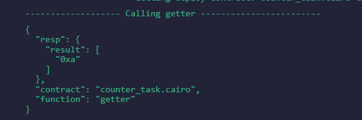
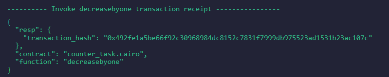
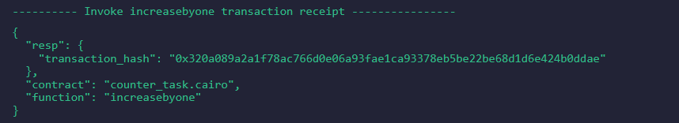

"transaction_hash": "0x638b51696fc3d6bdad1768f841704470d4177709713fa47e3234d6314b62d0",
  "contract_address": [
    "0x52b0e6159e7c1678f8c7e90b85b8fb40cf006a2b581fad432ff1ea15fc57ec9"
  ]

Get function:
  

decrease function:


increase function:



Code:
```#[starknet::interface]
trait ICounter<T> 
{
    fn getter(self: @T) -> u128;
    fn increasebyone(ref self: T);
    fn decreasebyone(ref self: T);

}

#[starknet::contract]
mod Counter{
    use traits::Into;
    #[storage]
    struct Storage{
        number: u128
    }
    #[constructor]
    fn constructor(ref self: ContractState, number_: u128) {
        self.number.write(number_);
    }
    #[abi(embed_v0)]
      impl Counter of super::ICounter<ContractState>
      {
        fn getter(self: @ContractState) -> u128 {  
            self.number.read()
        }
        fn increasebyone(ref self: ContractState){   
            self.number.write( self.number.read() + 1 );
        }
        fn decreasebyone(ref self: ContractState){  
            self.number.write( self.number.read() - 1 );
        }
        }
}```